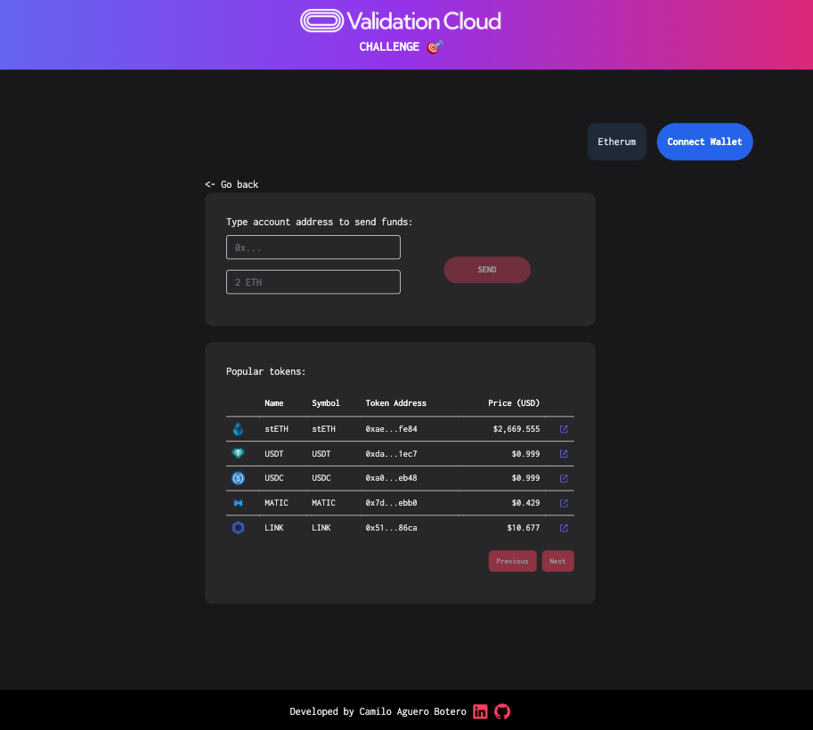

Coding challenge for [Validation Cloud](https://www.validationcloud.io/).



## Getting Started

First, run the development server:

```bash
npm install
npm run dev
```

Open [http://localhost:3000](http://localhost:3000) with your browser to see the result.

## Details

It was built using NextJS 14, Typescript and Tailwind. It uses Moralis and Alchemy SDKs to fetch data on chain. And uses Wagmi, WalletConnect, and Viem to connect to the blockchain. 
